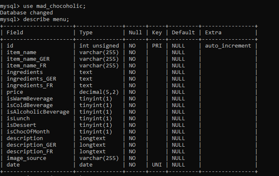

# My First MVP (Minimal Viable Product)

Mademoiselle Chocoholic's Website

## Description

This README file provides an overview of the project, its features, installation instructions, and usage guidelines.

For this project, a fictional cafe owner was invented: Mademoiselle Chocoholic. She owns an Austrian café with a chocolate theme. "Mad Chocoholic" wants to attract more tourists and, therefore, have the website function in three languages: English, German, and French. She needs three pages for the users: `Home`, `Menu`, and About (`Visit the Café`), as well as an admin area where she can easily view, add, edit, and delete menu items.

## Database

The necessary database for this website consists of one table (`menu`) with the following 19 columns:

- id
- item_name
- item_name_GER
- item_name_FR
- ingredients
- ingredients_GER
- ingredients_FR
- price
- isWarmBeverage
- isColdBeverage
- isAlcoholicBeverage
- isLunch
- isDessert
- isChocOfMonth
- description
- description_GER
- description_FR
- image_source
- date (unique key)

`isChocOfMonth` as well as the description in all three languages and the image_source all store the content for the `Home` page, while the rest of the columns are mostly needed on the `Menu` page.

## Features, Pages, and Usage

### Language feature:

By clicking on the top buttons `English`, `German`, and `French`, the content of all three main pages (`Home`, `Menu`, `Visit the Café`) will be displayed in the respective language.

### Pages and Usage:

1. `Home`:
   React Route: "/"

This page displays the `Choc of the Month` that is fetched from the MySQL database via GET request. The name of the item, as well as the image and the description are called and displayed. There is a preset `Loading...` object that will be displayed until the items have been successfully fetched and displayed.
The link to the menu at the end of the text that says `click here` is being added dynamically with the `addLink` function. Every menu item has this keyword in the description for all three languages.

2. `Menu`:
   React Route: "/menu"

Here, too, the content is fetched via GET request and there is a preset `Loading...` object that will be displayed until the items have been successfully fetched and displayed.
Users can view the whole menu with names of each item, ingredients, and prices.
Within the ftech request, there are filters to sort all items accordingly to their boolean state (isWarmBeverage, isColdBeverage, isLunch, etc.), so that they will be displayed in the right spot on the menu.

3. `Visit the Café`:
   React Route: "/visit-the-cafe"

This is just a static and the least interesting page. For the future, it would be nice to have a contact form here to make reservations, but for now it's just here to round up the image of the Mademoiselle Chocoholic prototype.

4. Admin:
   React Route: "/admin"

A GET request fetches all relevant information within a table that the café owner wants to take a look at and adapt/change/delete.
At the bottom of the page, there are three buttons that lead to three other components/micro-pages: `Add a New Item`, `Edit an Item`, and `Delete an Item`.

5. Add:
   React Route: "/add"

By filling out the entire form, the café owner can add a new item to the inventory/menu. She has to fill out everything, otherwise an alert-message will pop up and nothing will be sent to the database. This is to avoid her adding incomplete rows that will mess up the what is displayed on her website.

6. Edit:
   React Route: "/edit"

First, Mademoiselle Chocoholic has to input the ID of the item she wants to edit and submit. Then, she'll see the same form as to add a new item, but with pre-filled input fields and pre-selected select-dropdowns that contain exactly the information of the item she wants to edit. This makes things a bit easier and quicker for her. She only has to make the necessary changes, plus (unfortunately) also always adapt the date because it shows up a bit messed up. She has to add one day and delete the time. Most certainly, there will be an alert if the French text hasn't been adapted as well. The alert message will explain that she must check for single apostrophes in the French text that are causing an error in the backend. To escape the single apostrophes that are being read as quotation marks, she must add a second one right next to it (e.g. change "l'harmonie parfaite" to "l''harmonie parfaite"). These irritating bugs should be fixed in the future. Here too, no field must be left empty before the edited form can be submitted. If the café owner wishes to cancel the process, she will be brought back to the point where she can add the ID of an item she wishes to edit.

7. Delete:
   React Route: "/delete"

Works similarily as the Edit page: First, the café owner has to input the ID of the item she wishes to remove from the menu. Then Mademoiselle Chocoholic will be asked if she is sure that she wants to delete the following menu item (incl. the item ID and name in English). Finally, the item will be removed from the inventory/menu. If the item with the given ID does not exist, a pop-up message will let Mademoiselle Chocoholic know.

## Installation

To install and run this MVP locally, follow these steps:

1. Clone the repository:
   git clone https://github.com/Steph-Aniee/my-first-mvp.git
2. Navigate to the project directory:
   cd my-first-mvp
3. Install the dependencies:
   npm install
4. Navigate to the client and repeat:
   - cd client
   - npm install
5. Configure the environment variables:
   - Open the `.env` file.
   - Replace the values with your specific configuration (especially your PW for mySQL).
   - Before the next steps, ypu should create a mySQL database named `mad_chocoholic`
   - Then you can cd back to my-first-mvp and run the following request in the terminal: `npm run migrate`. This will trigger the database.js to fill the `mad_chocoholic` database with all the necessary preset data for the website.
6. Start the application:
   npm start
7. run the development server:
   - cd client
   - npm run dev
8. Access the application in your browser at `http://localhost:5173`.

## Contributing

Contributions are welcome! To contribute to my MVP, follow these steps:

1. Fork the repository.
2. Create a new branch:
   git checkout -b feature/your-feature
3. Make your changes and commit them:
   git commit -m "Add your commit message here"
4. Push your changes to your forked repository:
   git push origin feature/your-feature
5. Open a pull request in the original repository.

## Acknowledgements

- Vite + React
- Node.js
- Express.js
- MySQL
- ChatGPT (for creating all the content, such as the text on the 'Visit the Café' page and the whole menu in three languages)
